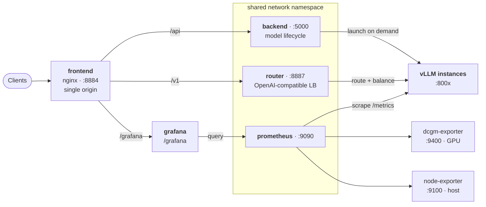
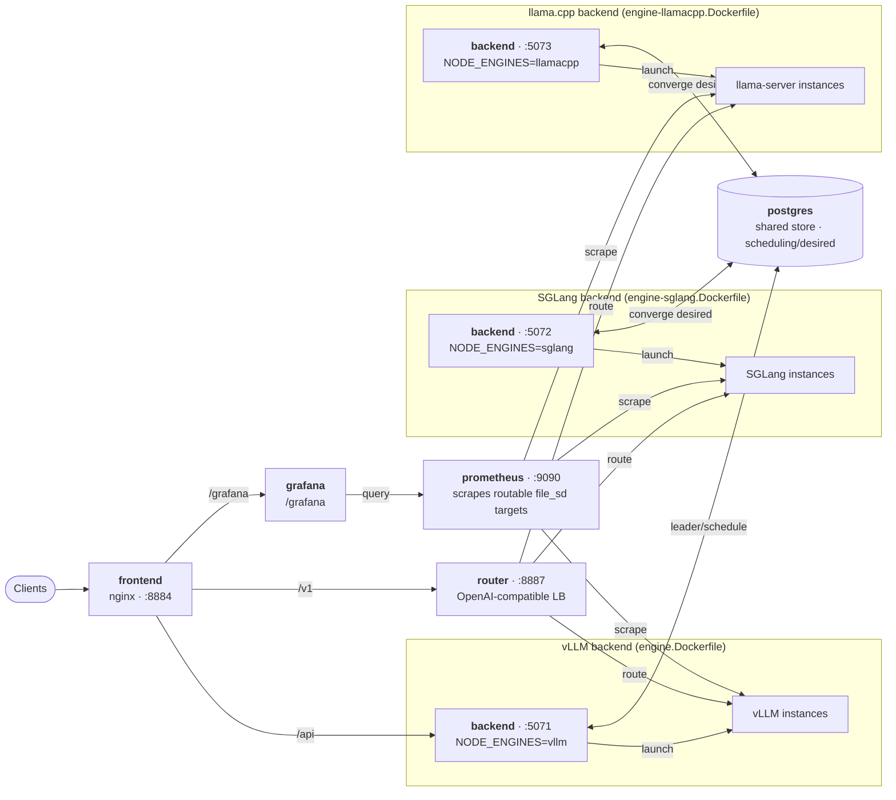

<div align="center">

<p align="center">
  
</p>

**One-stop platform to deploy, route, monitor & evaluate your vLLM cluster**

[English](README.md) · [中文](README_zh-CN.md)


</div>

---

**vLLMux** is a self-hosted control plane for serving many LLMs on
[vLLM](https://github.com/vllm-project/vllm). Paste a `vllm serve …` command and it
becomes a routable model; the router load-balances across instances; and a bundled Prometheus + Grafana stack monitors everything — all behind one Vue dashboard.

## Highlights

- **One router controls the whole fleet** — a single OpenAI- & Anthropic-compatible origin fronts every model. Route by the `model` field across `/v1/chat/completions`, `/v1/messages`, `/v1/embeddings`, `/v1/rerank`, `/v1/score`, `/tokenize` and more; the router resolves the group and load-balances its instances, so clients never address an instance directly.
- **Three inference engines, one control plane — vLLM, SGLang & llama.cpp** — choose the engine per model (the *Add Model* dialog has an engine selector); an engine-aware scheduler places each model on a backend that can run it, and the same router / dashboard / monitoring front them all. Run a **vLLM-only** stack (`make up`) or a **mixed** fleet (`make up-mixed`) that adds SGLang and a llama.cpp (GGUF / CPU-offload) backend. See [docs/mixed-engine-deployment.md](docs/mixed-engine-deployment.md).
- **Add a model by pasting `vllm serve …`** — parsed into a form and layered on as a dynamic overlay; the router hot-reloads, no `config.yaml` edits.
- **Lifecycle + self-healing** — per-instance state machine (`stopped → starting → ready → sleeping → failed`), VRAM pre-flight guard, GPU auto-placement, crash auto-restart with backoff.
- **Autoscaling with a warm-standby tier** — per group, keep `min_ready` replicas warm and scale up on queue depth (wake first, else cold-start) to `max_ready`; fold idle replicas back down `ready → sleep → stop`. vLLM **sleep mode** (level-1) frees a replica's VRAM but wakes in seconds, so scaling down needn't mean a minute-long cold start. Set it from config.yaml or the dashboard; a live Grafana dashboard + alerts are bundled.
- **Cross-model fallback** — give a group a `fallback` chain so a request degrades to another compatible model when the whole group is down, instead of failing.
- **Pluggable routing strategies** — pick the load-balancing policy per model group or globally: `least_load` (default), `round_robin`, `random`, `least_inflight`, `p2c`, plus `session_affinity` / `prefix_affinity` for cache reuse on multi-turn chat & shared prompts. Switch it live from the dashboard; transparent failover + per-backend cooldown apply to every strategy.
- **Cross-instance KV-cache sharing** — toggle it per model group in the editor: instances offload/load KV blocks to a shared store (vLLM `OffloadingConnector`) so a prefix computed on one replica is reused by another (verified ~99% external prefix-cache hit, 31% lower TTFT on a warmed prompt). Traffic & topology views show which groups pool KV vs keep their own.
- **Live observability** — SSE status, animated system-topology & router-balancing graphs, per-model usage / latency / error stats.
- **Bundled Grafana monitoring** — Prometheus auto-discovers every running instance; Overview / Capacity / Performance / GPU / Host dashboards embedded in-app, with SLO thresholds & alerts.
- **Lifecycle alerting** — discrete model events (crash, restart-budget exhausted, recovered) pushed to Slack / Discord / a generic webhook, with per-sink severity floors and per-model cooldown; configured via env or the admin **Notifications** page (one-click test). Complements Grafana's metric alerts.
- **Playground** — OpenAI-compatible chat (streaming) / completions / embeddings / reranking, with reasoning display.
- **Benchmark & evaluate** — evalscope load tests (concurrency, arrival-rate, SLA auto-tune) plus 30+ accuracy datasets with LLM-as-judge.
- **Libraries** — browse / pre-download HF model weights & datasets from the UI; tool-calling parser helper; LoRA support.
- **Multi-user & audit** — role-based control (`viewer`/`operator`/`admin`) via named operator credentials, with a redacted **audit log** of every change; plus mint/revoke API keys with per-key usage attribution, rate limits and **token quotas** (total / daily / monthly). The env admin token and open local-dev still work unchanged.
- **Config versioning & backup** — the dynamic-model overlay (where every runtime change lives) is snapshotted on each mutation; export it as a portable file, import to restore, and roll back to any past version with a side-by-side diff — all from the admin **Config Versions** page. `config.yaml` is never rewritten.

See [docs/features.md](docs/features.md) for the full breakdown.

## Quick start

Requires Docker with the NVIDIA Container Toolkit (on WSL2, enable GPU support in
Docker Desktop).

```bash
cp deploy/.env.example deploy/.env   # set HF_TOKEN, which GPUs, the admin token
make up                              # build + start the whole stack
# open http://localhost:8884
```

`make down` stops it · `make logs` tails all services · `make ps` shows status.

**Two deployment modes:**

- **`make up`** — the default **vLLM-only** stack.
- **`make up-mixed`** — a **multi-engine** fleet: vLLM, SGLang and llama.cpp backends sharing one Postgres, router, dashboard and Grafana. Add a model from *Add Model → engine: `sglang` / `llamacpp`* and it is auto-placed on a backend that can run it. `make down-mixed` / `make logs-mixed` manage it. See [docs/mixed-engine-deployment.md](docs/mixed-engine-deployment.md).

```bash
curl http://localhost:8887/v1/models     # router: configured model groups
curl http://localhost:5000/api/models    # backend: lifecycle state of each instance
# http://localhost:8884/grafana          # dashboards + alerts
```

Every `deploy/.env` setting — host **ports** (`FRONTEND_PORT`/`ROUTER_PORT`/…), auth
tokens, GPU selection, and cache locations — is documented inline in
[deploy/.env.example](deploy/.env.example) and tabulated in
[docs/deployment.md#environment-variables-deployenv](docs/deployment.md#environment-variables-deployenv).
Full topology, the shared-netns rationale, volumes, and a manual run are in the same
[docs/deployment.md](docs/deployment.md).

## One endpoint for the whole fleet

Every model is reachable through a single OpenAI-compatible origin — the router on
`:8887` (or `/v1` via the dashboard's nginx). Pick the model by its `model` field and
the router load-balances across that group's instances:

| Endpoint | Purpose |
|---|---|
| `POST /v1/chat/completions` | Chat — streaming supported; load-balanced across the model group |
| `POST /v1/completions` | Text completion |
| `POST /v1/messages` | Anthropic-compatible Messages API — streaming supported (Anthropic SSE) |
| `POST /v1/messages/count_tokens` | Count tokens for a Messages request (no generation) |
| `POST /v1/embeddings` | Embeddings — OpenAI-compatible (forwarded to the embedding server) |
| `POST /v1/rerank` | Reranking — Jina/Cohere-compatible (`query` + `documents` → sorted `results`) |
| `POST /v1/score` | Pairwise relevance scoring (`text_1` × `text_2`) |
| `POST /tokenize` · `POST /detokenize` | Token utilities — text ⇄ token ids (any model kind) |
| `GET /v1/models` | List configured model groups |

```bash
curl http://localhost:8887/v1/chat/completions \
  -H 'Content-Type: application/json' \
  -d '{"model": "Qwen3-0.6B", "messages": [{"role": "user", "content": "hi"}]}'
```

Request/response shapes and auth details are in [docs/API.md](docs/API.md).

## Architecture

### vLLM-only (`make up`)



The **router only routes** — the **backend owns model lifecycle**. The frontend, router,
backend, and Grafana sit behind nginx on a single origin; backend, router, and Prometheus
share one network namespace so the spawned vLLM instances are reachable on `localhost`.

### Mixed vLLM + SGLang + llama.cpp (`make up-mixed`)

Each engine runs as its own backend container (they can't share a netns), sharing one
Postgres (scheduling / desired intent), one router, one dashboard and one monitoring stack.
Each backend publishes its ready instances as **routable addresses** to a shared file_sd that
Prometheus scrapes. See [docs/mixed-engine-deployment.md](docs/mixed-engine-deployment.md).



The leader's **engine-aware scheduler** places each model on a backend that can run its engine;
a control action landing on the wrong node is deferred to the owning one. SGLang serves
OpenMetrics, so Prometheus stores its metrics as `sglang_*` (underscore), while vLLM and
llama.cpp keep colons (`vllm:*`, `llamacpp:*`).

## Documentation

| Topic | |
|---|---|
| Deployment & topology | [docs/deployment.md](docs/deployment.md) |
| Mixed-engine (vLLM + SGLang) | [docs/mixed-engine-deployment.md](docs/mixed-engine-deployment.md) |
| Configuration (`config.yaml`) | [docs/configuration.md](docs/configuration.md) |
| Features in depth | [docs/features.md](docs/features.md) |
| Monitoring (Prometheus + Grafana) | [docs/monitoring.md](docs/monitoring.md) |
| HTTP API | [docs/API.md](docs/API.md) |

## Requirements

NVIDIA GPU (CUDA 13.1+ recommended) · 16GB+ RAM · 50GB+ disk.

> **Tip — running multiple instances on limited RAM.** Each vLLM instance runs
> `torch.compile` + CUDA-graph capture on startup, which is heavy on **system RAM**
> (not VRAM). On a small box (e.g. WSL2 with ~8GB RAM), launching a second instance
> of the same model can exhaust RAM and thrash swap, leaving the new instance stuck
> in `starting`. Add **`--enforce-eager`** to the launch command to skip compilation:
> startup drops from minutes to seconds and RAM/CPU pressure falls sharply, at a small
> inference-latency cost. RAM — not VRAM — is usually the bottleneck for multi-instance,
> so give WSL more memory (`.wslconfig` → `memory=12GB`, then `wsl --shutdown`) before
> scaling out.

## License

MIT — see [LICENSE](LICENSE).
