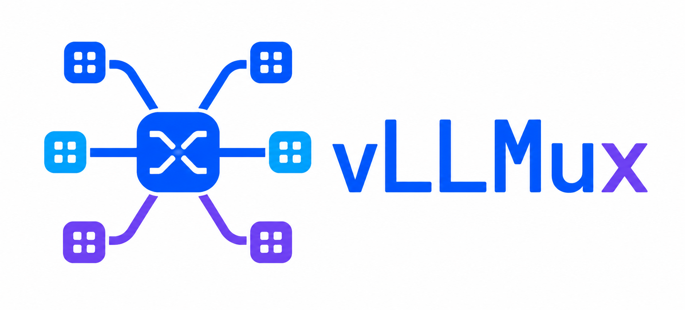
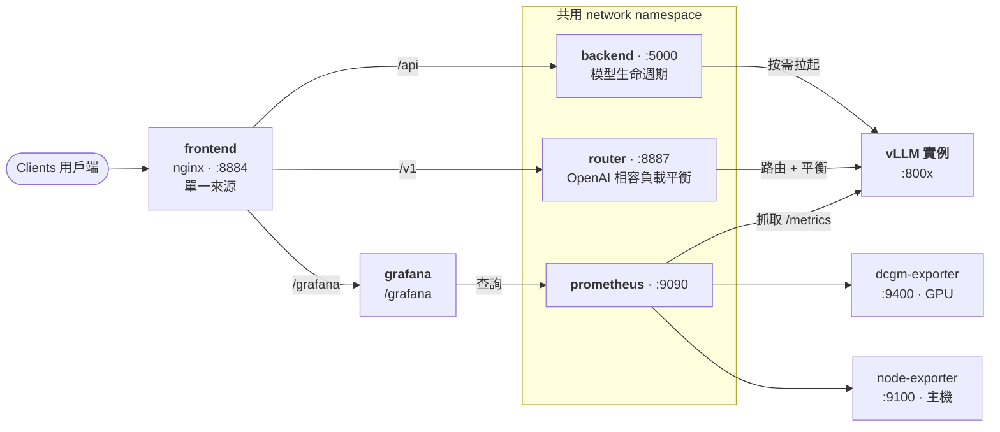

<div align="center">

<p align="center">
  
</p>

**一站式部署、路由、監控與評測你的 vLLM 集群**

[English](README.md) · [中文](README_zh-CN.md)


</div>

---

**vLLMux** 是一個自架的 LLM 服務控制平台，基於
[vLLM](https://github.com/vllm-project/vllm)。
內建的 Prometheus + Grafana 監控——全都在同一個 Vue 控制台之後。


## 功能亮點

- **一個 router 掌控整個集群** — 單一 OpenAI 與 Anthropic 相容入口統管所有模型。以 `model` 欄位路由 `/v1/chat/completions`、`/v1/messages`、`/v1/embeddings`、`/v1/rerank`、`/v1/score`、`/tokenize` 等端點；router 自動解析群組並在實例間負載平衡，客戶端永遠不直接連到單一實例。
- **貼上 `vllm serve …` 即可新增模型** — 解析成表單、以動態 overlay 疊加；router 熱重載。
- **生命週期** — 每實例狀態機（`stopped → starting → ready → sleeping → failed`）、VRAM 預檢防呆、GPU 自動擺放、崩潰指數退避自動重啟。
- **自動擴縮（含暖待命層）** — 每群組保留 `min_ready` 暖機副本，依佇列深度擴容（優先喚醒、其次冷啟）到 `max_ready`；閒置時逐階縮回 `ready → sleep → stop`。vLLM **sleep mode**（level-1）釋放副本 VRAM 但秒級喚醒，所以縮容不必付出數分鐘冷啟代價。config.yaml 或控制台皆可設定，內建即時 Grafana 面板與告警。
- **跨模型 fallback** — 給群組設 `fallback` 鏈，某模型整組下線時請求自動降級到另一個相容模型，而非直接失敗。
- **可插拔路由策略** — 每個模型群組或全域各自選負載平衡策略：`least_load`（預設）、`round_robin`、`random`、`least_inflight`、`p2c`,以及 `session_affinity` / `prefix_affinity`(多輪對話與共用 prompt 的快取重用）。可在控制台即時切換;失效轉移與每後端冷卻對所有策略一體適用。
- **跨 instance KV cache 共享** — 在模型編輯器逐群組開關：各副本透過共享 store（vLLM `OffloadingConnector`）互相重用算過的 KV,相同前綴不必重算（實測外部 prefix cache 命中率約 99%、暖過的 prompt TTFT 降 31%）。流量頁與系統拓撲會標示哪些群組共用、哪些各自獨立。
- **即時觀測** — SSE 狀態、動畫系統拓撲圖與 router 負載平衡圖、每模型用量／延遲／錯誤統計。
- **內建 Grafana 監控** — Prometheus 自動發現每個運行中的實例；總覽／容量／效能／GPU／主機 dashboards 嵌入應用內，含 SLO 門檻線與告警。
- **生命週期告警** — 離散的模型事件（崩潰、退避用盡、復原）推到 Slack／Discord／通用 webhook，含每個 sink 自訂嚴重度門檻與 per-model 去重；用環境變數或 admin「通知」頁（含一鍵測試）設定。與 Grafana 指標告警互補。
- **Playground** — OpenAI 相容的 chat（串流）／completions／embeddings／reranking。
- **壓測與評測** — LLM 壓測（並發、到達率、SLA 自動調優）＋ 30+ 個準確度資料集與 LLM-as-judge。
- **資料庫** — 在 UI 瀏覽／預下載 HF 權重與資料集；工具調用 parser 助手；LoRA 支援。
- **多使用者與稽核** — 以具名 operator 憑證做角色控管（`viewer`／`operator`／`admin`），並有脫敏的**稽核日誌**記錄每次變更；另可發行／撤銷 API 金鑰，帶 per-key 用量歸屬、速率上限與 **token 額度**（總量／每日／每月）。env 管理員權杖與本機 dev 開放模式維持不變。
- **設定版本化與備份** — 動態模型 overlay（所有 runtime 改動所在）每次變更都會自動快照；可一鍵匯出成可攜檔備份、匯入還原,也能在 admin「設定版本」頁看歷史、並排 diff 與一鍵回滾到任一版。`config.yaml` 永遠不會被改寫。

完整說明見 [docs/features_zh-CN.md](docs/features_zh-CN.md)。

## 快速開始

需要安裝 Docker 與 NVIDIA Container Toolkit（WSL2 請在 Docker Desktop 開啟 GPU 支援）。

```bash
cp deploy/.env.example deploy/.env   # 填 HF_TOKEN、要用的 GPU、管理員權杖
make up                              # 建置並啟動整套服務
# 瀏覽器開 http://localhost:8884
```

`make down` 停止 · `make logs` 追蹤所有服務日誌 · `make ps` 看狀態。

```bash
curl http://localhost:8887/v1/models     # router：列出設定的模型群組
curl http://localhost:5000/api/models    # 後端：每個實例的生命週期狀態
# http://localhost:8884/grafana          # dashboards 與告警
```

`deploy/.env` 的所有設定 —— 對外 **port**(`FRONTEND_PORT`/`ROUTER_PORT`/…)、驗證權杖、
GPU 選擇、快取路徑 —— 在 [deploy/.env.example](deploy/.env.example) 有逐行註解,並在
[docs/deployment_zh-CN.md#環境變數deployenv](docs/deployment_zh-CN.md#環境變數deployenv)
整理成表。完整架構、共用 netns 的原理、volumes 與手動啟動見同一份
[docs/deployment_zh-CN.md](docs/deployment_zh-CN.md)。

## 單一端口呼叫整個集群

所有模型都透過單一 OpenAI 相容入口存取——router 的 `:8887`（或經由控制台 nginx 的
`/v1`）。用請求中的 `model` 欄位指定模型，router 會在該群組的實例之間做負載平衡：

| 端點 | 用途 |
|---|---|
| `POST /v1/chat/completions` | 對話——支援串流；在模型群組內負載平衡 |
| `POST /v1/completions` | 文字補全 |
| `POST /v1/messages` | Anthropic 相容 Messages API——支援串流（Anthropic SSE） |
| `POST /v1/messages/count_tokens` | 計算 Messages 請求的 token 數（不生成） |
| `POST /v1/embeddings` | 向量嵌入——OpenAI 相容（轉發到 embedding 伺服器） |
| `POST /v1/rerank` | 重排序——Jina/Cohere 相容（`query` + `documents` → 排序好的 `results`） |
| `POST /v1/score` | 成對相關性打分（`text_1` × `text_2`） |
| `POST /tokenize` · `POST /detokenize` | Token 工具——文字 ⇄ token id（任何 kind 的模型） |
| `GET /v1/models` | 列出設定的模型群組 |

```bash
curl http://localhost:8887/v1/chat/completions \
  -H 'Content-Type: application/json' \
  -d '{"model": "Qwen3-0.6B", "messages": [{"role": "user", "content": "hi"}]}'
```

完整請求／回應格式與驗證說明見 [docs/API.md](docs/API.md)。

## 架構



**router 只負責路由**——**模型生命週期由 backend 掌管**。frontend、router、backend 與
Grafana 都在 nginx 之後以單一來源對外；backend、router、Prometheus 共用一個 network
namespace，所以被拉起的 vLLM 實例可在 `localhost` 互相連到。

## 文件

| 主題 | |
|---|---|
| 部署與架構 | [docs/deployment_zh-CN.md](docs/deployment_zh-CN.md) |
| 配置（`config.yaml`） | [docs/configuration_zh-CN.md](docs/configuration_zh-CN.md) |
| 功能特色（詳細） | [docs/features_zh-CN.md](docs/features_zh-CN.md) |
| 監控（Prometheus + Grafana） | [docs/monitoring_zh-CN.md](docs/monitoring_zh-CN.md) |
| HTTP API | [docs/API.md](docs/API.md) |

## 環境需求

NVIDIA GPU（建議 CUDA 13.1+）· 16GB+ RAM · 50GB+ 磁碟。

> **提示 — RAM 有限時跑多個 instance。** 每個 vLLM instance 啟動時都會做
> `torch.compile` + CUDA-graph capture，這非常吃**系統 RAM**（不是 VRAM）。在小機器上
> （例如 WSL2 只有 ~8GB RAM），對同一顆模型開第二個 instance 很容易把 RAM 吃光、swap
> 抖動，讓新 instance 一直卡在 `starting`。在啟動指令加上 **`--enforce-eager`** 即可跳過
> 編譯：啟動時間從數分鐘降到數秒、RAM/CPU 壓力大幅下降，代價只是推理延遲略增。多 instance
> 的瓶頸通常是 **RAM 而非 VRAM**，擴展前先把 WSL 記憶體加大（`.wslconfig` →
> `memory=12GB`，再 `wsl --shutdown`）。

## 授權

MIT — 見 [LICENSE](LICENSE)。
