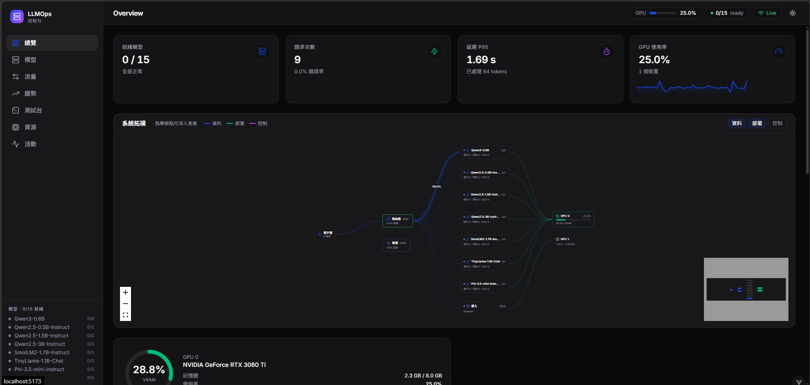
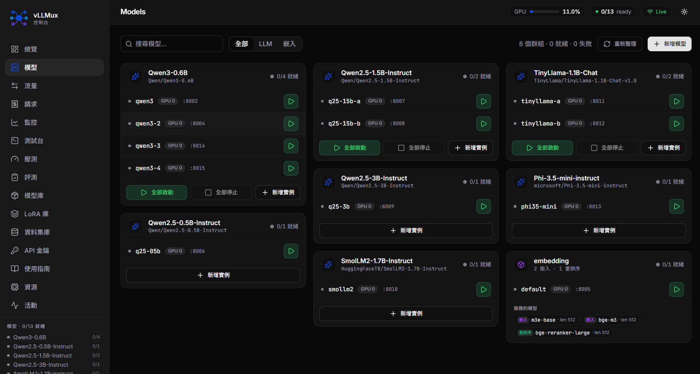

<div align="center">

# LLM-Router-Server-Dashboard
**一站式 LLM 模型管理與監控平台**





</div>

---

## 專案簡介

**LLM-Router-Server-Dashboard** 是一個針對大型語言模型（LLM）部署與管理的解決方案，提供直觀的 Web 界面來管理、監控和操作多個 LLM 模型實例。

本專案結合路由伺服器（LLM-Router-Server）與易用的管理界面，讓您能夠：
- **視覺化管理**：透過 Web 界面輕鬆管理多個模型
- **動態啟停**：即時啟動、停止模型，無需重啟服務
- **即時監控**：監控模型狀態、GPU 使用率、系統資訊
- **配置管理**：透過 YAML 配置文件靈活管理模型參數

---

## 功能特色

### 核心功能

- **多模型管理**
  - 支援同時管理多個 LLM 模型（基於 vLLM）
  - 支援 Embedding 模型和 Reranking 模型
  - 獨立的模型生命週期管理（啟動/停止）
  - 基於即時指標自動選擇負載最低的實例（運行中請求數、等待中請求數、KV 快取使用率）

- **視覺化控制台**
  - 實時顯示模型運行狀態
  - GPU 資源監控
  - 系統資源使用率統計
  - 模型配置查看與編輯

- **資源管理**
  - GPU 設備分配與管理
  - 記憶體使用率監控
  - 多卡並行支援（Tensor Parallel）

---

## 環境需求

### 硬體需求
- **GPU**: NVIDIA GPU（建議 CUDA 12.1+）
- **記憶體**: 16GB+ RAM（依模型大小而定）
- **硬碟**: 50GB+ 可用空間
---

## 快速開始

### 前端部署

#### 1. 使用 Docker 建立前端容器

```bash
# 所有容器集中於 deploy/（build context 為 repo 根目錄）
docker compose -f deploy/docker-compose.yaml up -d frontend
```

#### 2. 本地開發模式

```bash
cd apps/frontend
npm install
npm run dev
```

#### 3. 生產環境建置

```bash
cd apps/frontend
npm install
npm run build
```

#### 4. 配置前端 API 端點

編輯 `apps/frontend/.env.local`：
```env
VITE_API_BASE_URL=http://localhost:5000
VITE_MODEL_CONTROL_PASSWORD=123
```

#### 5. 自訂服務器配置

編輯 `apps/frontend/vite.config.js`：
```javascript
export default defineConfig({
  server: {
    host: '0.0.0.0',  // 允許外部訪問
    port: 5111        // 自訂端口
  }
})
```

### 後端部署

**重要提醒**：後端需要監聽 LLM 模型狀態（進程管理），因此必須與 LLM-Router-Server 在同一個容器內運行。

#### 1. 建立容器

```bash
# 後端與 router 共用同一容器（見 deploy/backend-router.Dockerfile）
docker compose -f deploy/docker-compose.yaml up -d backend-router
```

**確保 docker-compose.yaml 中暴露了必要的端口**：
- `8887`: LLM-Router-Server API
- `5000`: Dashboard 後端 API
- 其他模型端口（如 8002, 8003 等）

#### 2. 在容器內啟動後端

```bash
# 進入容器
docker exec -it <container_id> bash

# 啟動後端
cd apps/backend
pip install -r requirements.txt
uvicorn main:app --reload --host 0.0.0.0 --port 5000
```

### LLM-Router-Server 部署
安裝&啟動細節可參考 [LLM-Router-Server 啟動指南](apps/router-server/README_zh.md)
#### 1. 在容器內啟動路由服務器

```bash
cd /app/apps/router-server
pip install -r requirements.txt
sh scripts/start_all.sh /app/packages/config-schema/config.yaml ./configs/gunicorn.conf.py
```

**注意**：配置文件統一使用 `packages/config-schema/config.yaml`（單一來源），確保前端、後端與 router 讀到同一份設定。

**模型生命週期**：router 只負責路由與負載平衡，不再啟動模型。模型進程（vLLM 實例、Embedding/Reranker 服務）由 Dashboard 後端管理，透過 `POST /api/models/{key}/start` 按需啟動。

#### 2. 驗證服務狀態

```bash
# 檢查路由服務器（列出設定的模型群組）
curl http://localhost:8887/v1/models

# 檢查後端 API（每個模型實例的生命週期狀態）
curl http://localhost:5000/api/models
```

---

## 配置說明

### config.yaml 結構

配置文件位於 `packages/config-schema/config.yaml`（單一來源，由 `packages/config-schema/schema.py` 驗證），控制所有模型的啟動參數。

```yaml
# 路由服務器配置
server:
  host: "0.0.0.0"
  port: 8887
  uvicorn_log_level: "info"

# LLM 模型配置
LLM_engines:
  Qwen3-0.6B:
    instances:
      - id: "qwen3"
        host: "localhost"
        port: 8002
        cuda_device: 0
      - id: "qwen3-2"
        host: "localhost"
        port: 8004
        cuda_device: 0

    model_config:
      model_tag: "Qwen/Qwen3-0.6B"
      dtype: "float16"
      max_model_len: 500
      gpu_memory_utilization: 0.35
      tensor_parallel_size: 1

# Embedding 服務器配置（可選）
embedding_server:
  host: "localhost"
  port: 8005
  cuda_device: 1
  
  embedding_models:
    m3e-base:
      model_name: "moka-ai/m3e-base"
      model_path: "./models/embedding_engine/model/embedding_model/m3e-base-model"
      tokenizer_path: "./models/embedding_engine/model/embedding_model/m3e-base-tokenizer"
      max_length: 512
      use_gpu: true
      use_float16: true
  
  reranking_models:
    bge-reranker-large:
      model_name: "BAAI/bge-reranker-large"
      model_path: "./models/embedding_engine/model/reranking_model/bge-reranker-large-model"
      tokenizer_path: "./models/embedding_engine/model/reranking_model/bge-reranker-large-tokenizer"
      max_length: 512
      use_gpu: true
      use_float16: true
```

### 關鍵參數說明

| 參數 | 說明 | 建議值 |
|------|------|--------|
| `gpu_memory_utilization` | GPU 記憶體使用比例 | 0.6-0.9 |
| `max_model_len` | 最大上下文長度 | 依模型能力 |
| `tensor_parallel_size` | 多 GPU 並行數 | GPU 數量 |
| `dtype` | 推理精度 | float16（速度快） / bfloat16（更穩定） |
| `cuda_device` | GPU 設備編號 | 0, 1, 2... |

---

### Q4: 為什麼不能同時啟動多個模型？

**設計限制**：當前版本必須逐一啟動模型，以確保：
- GPU 資源正確分配
- 避免記憶體溢出
- 進程管理穩定性

未來版本將優化並行啟動支援。