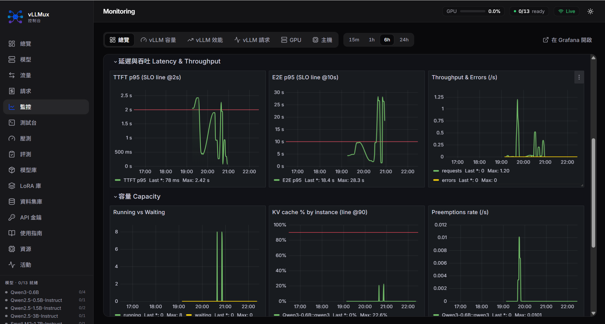

<div align="center">

# vLLMux

**一站式部署、路由、監控與評測你的 vLLM 集群**

[English](README.md) · [中文](README_zh-CN.md)




</div>

---

**vLLMux** 是一個自架的 LLM 服務控制平台，基於
[vLLM](https://github.com/vllm-project/vllm)。
內建的 Prometheus + Grafana 監控——全都在同一個 Vue 控制台之後。


## 功能亮點

- **貼上 `vllm serve …` 即可新增模型** — 解析成表單、以動態 overlay 疊加；router 熱重載。
- **生命週期** — 每實例狀態機（`stopped → starting → ready → failed`）、VRAM 預檢防呆、GPU 自動擺放、崩潰指數退避自動重啟。
- **負載感知路由** — 自動挑負載最低的副本（運行中／等待中請求 + KV 快取使用率）。
- **即時觀測** — SSE 狀態、動畫系統拓撲圖與 router 負載平衡圖、每模型用量／延遲／錯誤統計。
- **內建 Grafana 監控** — Prometheus 自動發現每個運行中的實例；總覽／容量／效能／GPU／主機 dashboards 嵌入應用內，含 SLO 門檻線與告警。
- **Playground** — OpenAI 相容的 chat（串流）／completions／embeddings／reranking。
- **壓測與評測** — LLM 壓測（並發、到達率、SLA 自動調優）＋ 30+ 個準確度資料集與 LLM-as-judge。
- **資料庫** — 在 UI 瀏覽／預下載 HF 權重與資料集；工具調用 parser 助手；LoRA 支援。
- **安全性** — 管理員權杖控管操作，並可發行／撤銷帶 per-key 用量歸屬的 API 金鑰。

完整說明見 [docs/features_zh-CN.md](docs/features_zh-CN.md)。

## 快速開始

需要安裝 Docker 與 NVIDIA Container Toolkit（WSL2 請在 Docker Desktop 開啟 GPU 支援）。

```bash
cp deploy/.env.example deploy/.env   # 填 HF_TOKEN、要用的 GPU、管理員權杖
make up                              # 建置並啟動整套服務
# 瀏覽器開 http://localhost:8884
```

`make down` 停止 · `make logs` 追蹤所有服務日誌 · `make ps` 看狀態。

```bash
curl http://localhost:8887/v1/models     # router：列出設定的模型群組
curl http://localhost:5000/api/models    # 後端：每個實例的生命週期狀態
# http://localhost:8884/grafana          # dashboards 與告警
```

完整架構、共用 netns 的原理、volumes 與手動啟動見
[docs/deployment_zh-CN.md](docs/deployment_zh-CN.md)。

## 架構


**router 只負責路由**——**模型生命週期由 backend 掌管**。frontend、router、backend 與
Grafana 都在 nginx 之後以單一來源對外；backend、router、Prometheus 共用一個 network
namespace，所以被拉起的 vLLM 實例可在 `localhost` 互相連到。

## 文件

| 主題 | |
|---|---|
| 部署與架構 | [docs/deployment_zh-CN.md](docs/deployment_zh-CN.md) |
| 配置（`config.yaml`） | [docs/configuration_zh-CN.md](docs/configuration_zh-CN.md) |
| 功能特色（詳細） | [docs/features_zh-CN.md](docs/features_zh-CN.md) |
| 監控（Prometheus + Grafana） | [docs/monitoring_zh-CN.md](docs/monitoring_zh-CN.md) |
| HTTP API | [docs/API.md](docs/API.md) |

## 環境需求

NVIDIA GPU（建議 CUDA 13.1+）· 16GB+ RAM · 50GB+ 磁碟。

## 授權

MIT — 見 [LICENSE](LICENSE)。
