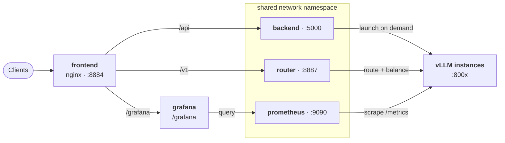
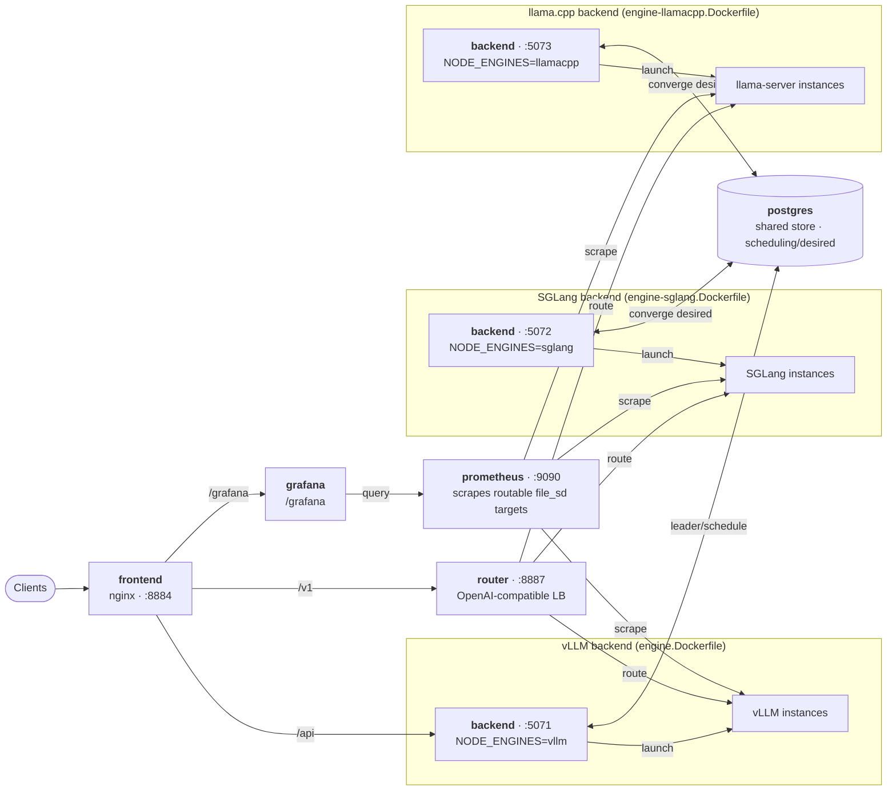

# Mixed-engine deployment (vLLM + SGLang + llama.cpp in one fleet)

> [中文](mixed-engine-deployment_zh-CN.md)

> A vLLM backend + a SGLang backend + a llama.cpp backend share **one Postgres, one router, one
> dashboard**. Each backend runs only its own engine's image; the leader's engine-aware scheduler
> places every model on a node that can run it, and a control action that lands on the wrong node is
> **deferred** to the owning node (HA Phase 7C). **Runs on a single host** (three containers
> sharing one GPU). Live-validated: add a SGLang or llama.cpp model from the dashboard → it auto-runs
> on the matching backend → it's routed through the same router.

## Two deployment modes — architecture

**vLLM-only (`make up`)** — backend, router and Prometheus share one network namespace, so the
spawned vLLM subprocesses are reachable on `localhost:800x` from both the router and Prometheus:



**Mixed vLLM + SGLang + llama.cpp (`make up-mixed`)** — each engine runs as its own backend
container (they can't share a netns), sharing one Postgres (scheduling / desired intent), one
router, one dashboard and one monitoring stack. Each backend writes its ready instances to a shared
file_sd with **routable addresses**, which Prometheus scrapes together:



## Why one backend per engine

vLLM, SGLang and llama.cpp each pin incompatible torch/CUDA/runtime stacks — cramming them into one
image fights itself (llama.cpp ships its own `llama-server` binary + GGML libs, not torch at all).
The launcher **spawns the engine subprocess inside the backend container**, so "which engines a
backend can run = what's installed in its image". Hence one image per engine, each running its own
backend node. See [multi-backend-engine-design](multi-backend-engine-design_zh-CN.md) §5 and, for
llama.cpp specifically, [llamacpp-launcher-impl-design_zh-CN.md](llamacpp-launcher-impl-design_zh-CN.md).

## Quick start

```bash
make up-mixed      # build + start postgres + vLLM + SGLang + llama.cpp backends + router + dashboard
make logs-mixed    # tail logs
make down-mixed    # tear down
```

Needs `deploy/.env` (admin token, HF token, session secret, …) — the same file as plain `make up`.

Ports (override via env): dashboard `:8884`, router `:8887`, vLLM backend API `:5071`,
SGLang backend API `:5072`, llama.cpp backend API `:5073`.

## Using a non-vLLM model (SGLang / llama.cpp)

1. Open the dashboard (`http://localhost:8884`), **Add Model** → **Inference engine** = `sglang` or
   `llamacpp`, fill in the model, submit. (Or `POST /api/models` with
   `model_config.engine = "sglang" | "llamacpp"`.)
   - **SGLang**: `model_tag` is a HF repo (same as vLLM).
   - **llama.cpp**: `model_tag` is a **GGUF** source — a HF GGUF repo (e.g.
     `Qwen/Qwen2.5-0.5B-Instruct-GGUF`, pick a `gguf_quant` like `Q4_K_M`) or a local `.gguf` path.
     Or paste a `llama-server -hf … -ngl 99 -c 4096` command into **Add Model** and it's parsed.
2. Hit **Start**. Even if your dashboard is connected to the vLLM backend, that's fine: it writes
   the "intent" into the shared store, the scheduler assigns the model to the **matching node**, and
   that backend brings it up itself (the overlay auto-syncs to every node).
3. Send inference to the router (`:8887/v1/...`) with `model: <group>`; the router routes it to the
   owning backend.

> **Engine capabilities differ** (the UI/autoscaler gate on capabilities, never on the engine name):
> - **SGLang**: no sleep mode (autoscaler degrades to `ready ↔ stopped`); runtime LoRA, metrics and
>   autoscaling all supported.
> - **llama.cpp**: no sleep, no cross-instance KV sharing, and **no runtime hot-add of a new LoRA**
>   (only launch-time GGUF `--lora` adapters, which can be rescaled). Metrics (`llamacpp:*`) and
>   autoscaling work, but there is **no KV-cache-usage metric**, so scaling uses running/queued only.
>   Its niche is GGUF / quantized / CPU-offload (`n_gpu_layers`) serving. See
>   [llamacpp-launcher-impl-design_zh-CN.md](llamacpp-launcher-impl-design_zh-CN.md).

## How it works (mapped to code)

| Mechanism | What | Code |
|---|---|---|
| **node declares engine** | `LLMOPS_NODE_ENGINES=vllm` / `sglang` / `llamacpp` (one per image) written to `nodes.engines` | [node_agent.py](../apps/backend/app/llmops/node_agent.py) |
| **engine-aware scheduling** | each desired-running model is assigned to the emptiest node that can run its engine; a misplaced model is moved | [scheduler.py](../apps/backend/app/llmops/scheduler.py) `place()` |
| **write intent (Phase 7C)** | start/stop on a node that can't run the engine → only writes desired, no local spawn; the owner converges | [manager.py](../apps/backend/app/llmops/manager.py) `_defer_to_owner` |
| **per-node convergence** | each node starts/stops the models assigned to it (not just the leader) | [reconciler.py](../apps/backend/app/llmops/reconciler.py) `converge_desired` |
| **overlay sync** | models added dynamically from the dashboard propagate to every node's registry via the store | [manager.py](../apps/backend/app/llmops/manager.py) `sync_overlay_from_store` |
| **cross-container routing** | each node binds to a routable address (`LLMOPS_VLLM_BIND_HOST=0.0.0.0`), written to `instances_live`; the router connects accordingly | [launchers.py](../apps/backend/app/llmops/launchers.py) / [metrics_poller.py](../apps/router-server/src/llm_router/metrics_poller.py) |
| **monitoring (parity with main compose)** | Prometheus + dcgm-exporter + node-exporter; each backend writes its ready instances as **routable addresses** to file_sd files in the shared `mixed-sd` volume (`build_targets(node_host=...)`), Prometheus globs `/etc/prometheus/targets/*.json`; Grafana datasource points at `mixed-prometheus` | [prometheus.mixed.yml](../deploy/prometheus.mixed.yml) / [prometheus_targets.py](../apps/backend/app/services/prometheus_targets.py) |

## Metric naming (important)

- **vLLM** uses the classic Prometheus text format → metric names keep colons
  (`vllm:num_requests_running`); the official vLLM dashboards work unchanged.
- **SGLang** uses **OpenMetrics** (colons not allowed in names) → on ingest Prometheus normalizes
  `:` to `_` (`sglang:num_running_reqs` → `sglang_num_running_reqs`). So the SGLang Grafana
  dashboard always queries `sglang_*`.
- **llama.cpp** uses the classic Prometheus text format (like vLLM) → names keep colons
  (`llamacpp:requests_processing`, `llamacpp:requests_deferred`); the bundled llama.cpp dashboard
  queries `llamacpp:*`. It exposes **no KV-cache-usage** metric.
- (The router's autoscaler parses the **raw endpoint text** (colon names), not Prometheus, so it's
  unaffected.)

## Limitations

- **GPU capacity**: on a single GPU, both engines' models + their KV caches must fit on the same
  card. An 8GB card running two small models at once is tight (lower each model's
  `gpu_memory_utilization` / `max_model_len`). True multi-GPU parallel acceleration needs physical
  multi-GPU.
- Auto-placement only applies in Postgres (HA) mode; single-host SQLite is collapsed (one node runs
  everything), behavior unchanged.
