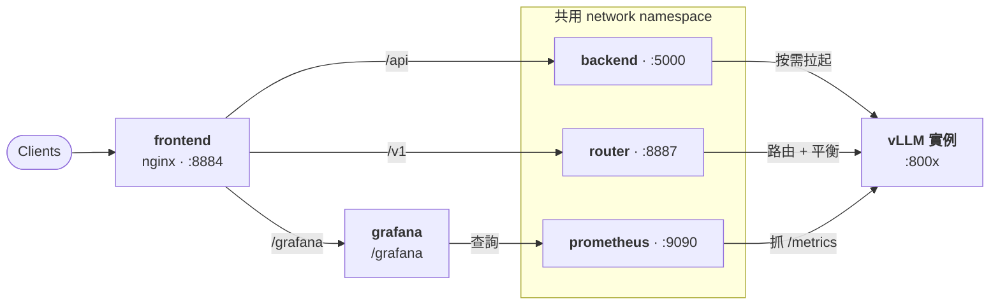
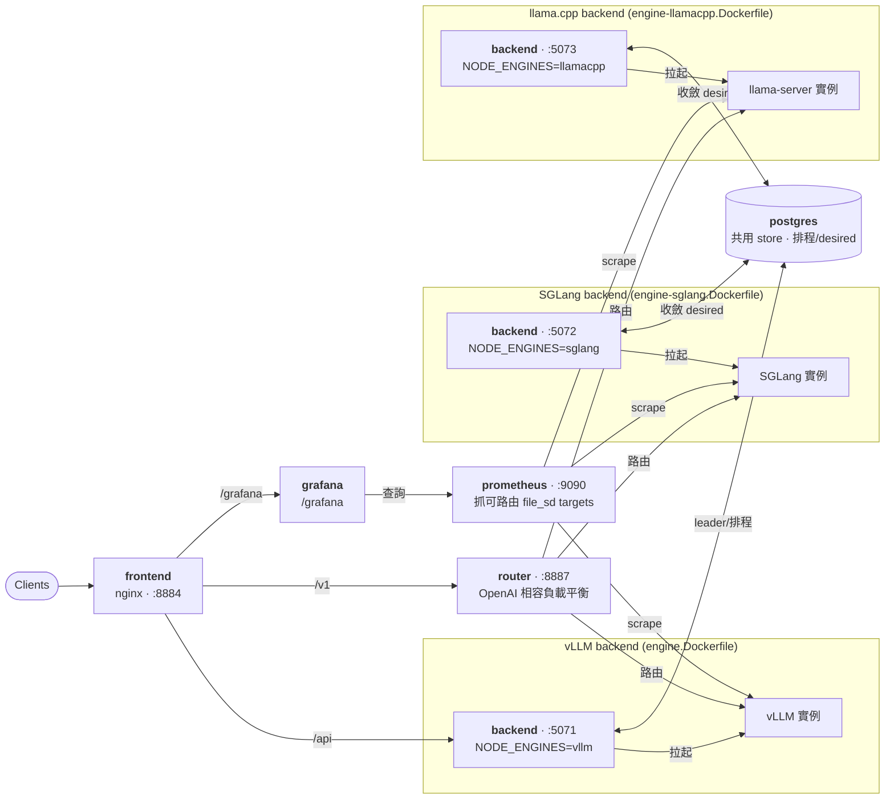

# 混合引擎部署（vLLM + SGLang + llama.cpp 同一個 fleet）

> 一個 vLLM backend + 一個 SGLang backend + 一個 llama.cpp backend 共享**一顆 Postgres、一個 router、
> 一個 dashboard**。每個 backend 只跑自己引擎的 image,leader 的 engine-aware 排程把每個模型放到能跑它的
> node 上;不在對的 node 上的控制動作會被「延後」給擁有者執行(HA Phase 7C)。**單機就能跑**(三個容器共享
> 一張卡)。已 live 驗證:從 dashboard 新增一個 SGLang 或 llama.cpp 模型 → 自動跑到對應 backend → 經同一個
> router 路由。

## 兩種啟動方式的架構

**純 vLLM（`make up`）** — backend、router、Prometheus 共用一個 network namespace，
被拉起的 vLLM 子進程在 `localhost:800x` 即可被 router 與 Prometheus 連到：



**vLLM + SGLang + llama.cpp 混合（`make up-mixed`）** — 三個引擎各跑一個 backend 容器（無法共用 netns），
共用一顆 Postgres（排程／desired 意圖）、一個 router、一個 dashboard 與一套監控；各 backend 把
自己 ready 的實例以**可路由位址**寫進共享的 file_sd，Prometheus 一起抓：



## 為什麼一個引擎一個 backend

vLLM、SGLang、llama.cpp 各自死釘不同的 torch/CUDA/runtime,塞同一個 image 會打架（llama.cpp 是自帶
`llama-server` binary + GGML 函式庫,根本不用 torch）。launcher 是**在 backend 容器內 spawn 引擎子行程**,
所以「一個 backend 能跑哪些引擎 = 它 image 裡裝了什麼」。因此每個引擎一顆 image,各跑一個 backend node。
見 [multi-backend-engine-design](multi-backend-engine-design_zh-CN.md) §5;llama.cpp 細節見
[llamacpp-launcher-impl-design_zh-CN.md](llamacpp-launcher-impl-design_zh-CN.md)。

## 快速啟動

```bash
make up-mixed      # build + 起 postgres + vLLM + SGLang + llama.cpp backend + router + dashboard
make logs-mixed    # 看 log
make down-mixed    # 收掉
```

需要 `deploy/.env`(admin token、HF token、session secret 等,跟一般 `make up` 同一份)。

埠(可用環境變數覆蓋):dashboard `:8884`、router `:8887`、vLLM backend API `:5071`、
SGLang backend API `:5072`、llama.cpp backend API `:5073`。

## 怎麼用非 vLLM 模型（SGLang / llama.cpp）

1. 開 dashboard(`http://localhost:8884`),**Add Model** → **Inference engine** 選 `sglang` 或 `llamacpp`,
   填模型,送出。(或 `POST /api/models`,`model_config.engine = "sglang" | "llamacpp"`。)
   - **SGLang**:`model_tag` 是 HF repo(同 vLLM)。
   - **llama.cpp**:`model_tag` 是 **GGUF** 來源——HF GGUF repo(例 `Qwen/Qwen2.5-0.5B-Instruct-GGUF`,再選
     `gguf_quant` 如 `Q4_K_M`)或本地 `.gguf` 路徑。也可在 **Add Model** 貼上
     `llama-server -hf … -ngl 99 -c 4096` 指令自動解析。
2. 按 **Start**。即使你的 dashboard 連到的是 vLLM backend 也沒關係:它會把「意圖」寫進共享 store,
   排程器把模型指派到**對應的 node**,那個 backend 自己把它起起來(overlay 會自動同步到每個 node)。
3. 用 `model: <group>` 對 router(`:8887/v1/...`)發推理即可,router 會路由到擁有它的 backend。

> **各引擎能力不同**（UI／autoscaler 一律依「能力」而非引擎名 gate）:
> - **SGLang**:無 sleep(autoscaler 退化成 ready↔stopped);runtime LoRA、metrics、autoscaling 都支援。
> - **llama.cpp**:無 sleep、無跨實例 KV 共享,且**不能 runtime 熱掛新 LoRA**(只能啟動時 GGUF `--lora`,可調
>   scale)。metrics(`llamacpp:*`)與 autoscaling 可用,但**無 KV 使用率指標**,擴縮只看 running/queued。
>   生態位是 GGUF／量化／CPU offload(`n_gpu_layers`)。見
>   [llamacpp-launcher-impl-design_zh-CN.md](llamacpp-launcher-impl-design_zh-CN.md)。

## 運作原理(對應程式)

| 機制 | 說明 | 程式 |
|---|---|---|
| **node 宣告引擎** | `LLMOPS_NODE_ENGINES=vllm` / `sglang` / `llamacpp`(每個 image 設一個)寫進 `nodes.engines` | [node_agent.py](../apps/backend/app/llmops/node_agent.py) |
| **engine-aware 排程** | 每個 desired-running 模型指派到「能跑它引擎」的最空 node;放錯 node 會搬走 | [scheduler.py](../apps/backend/app/llmops/scheduler.py) `place()` |
| **寫意圖(Phase 7C)** | 在不能跑該引擎的 node 上 start/stop → 只寫 desired,不本機 spawn;擁有者收斂 | [manager.py](../apps/backend/app/llmops/manager.py) `_defer_to_owner` |
| **per-node 收斂** | 每個 node 各自把「指派給它」的模型起/停(不是只有 leader) | [reconciler.py](../apps/backend/app/llmops/reconciler.py) `converge_desired` |
| **overlay 同步** | dashboard 動態加的模型透過 store 傳播到每個 node 的 registry | [manager.py](../apps/backend/app/llmops/manager.py) `sync_overlay_from_store` |
| **跨容器路由** | 各 node 用 `LLMOPS_VLLM_BIND_HOST=0.0.0.0` 綁可路由位址,寫進 `instances_live`,router 依此連 | [launchers.py](../apps/backend/app/llmops/launchers.py) / [metrics_poller.py](../apps/router-server/src/llm_router/metrics_poller.py) |
| **監控(對標主 compose)** | Prometheus + dcgm-exporter + node-exporter;各 backend 把 ready 實例以**可路由位址**寫進共享 `mixed-sd` volume 的 file_sd 檔(`build_targets(node_host=...)`),Prometheus glob `/etc/prometheus/targets/*.json` 一起抓;Grafana datasource 指向 `mixed-prometheus` | [prometheus.mixed.yml](../deploy/prometheus.mixed.yml) / [prometheus_targets.py](../apps/backend/app/services/prometheus_targets.py) |

## 監控指標命名(重要)

- **vLLM** 用傳統 Prometheus text 格式 → 指標名保留冒號(`vllm:num_requests_running`),官方 vLLM dashboard 照用不變。
- **SGLang** 用 **OpenMetrics** 格式(名稱不允許冒號)→ Prometheus 入庫時把 `:` 正規化成 `_`
  (`sglang:num_running_reqs` → `sglang_num_running_reqs`)。所以 SGLang Grafana dashboard 一律查 `sglang_*`。
- **llama.cpp** 用傳統 Prometheus text 格式(同 vLLM)→ 名稱保留冒號
  (`llamacpp:requests_processing`、`llamacpp:requests_deferred`);內建 llama.cpp dashboard 查 `llamacpp:*`。
  它**沒有 KV 使用率**指標。
- (router 的 autoscaler 解析的是**原始 endpoint 文字**(冒號名),不經 Prometheus,所以不受影響。)

## 限制

- **GPU 容量**:單機單卡上,兩個引擎的模型 + 各自的 KV 都要塞進同一張卡。8GB 卡同時跑兩個小模型會很緊
  (調低各模型的 `gpu_memory_utilization` / `max_model_len`)。真「並行多卡加速」需要實體多卡。
- 自動 placement 只在 Postgres(HA)模式生效;SQLite 單機是 collapsed(一個 node 跑全部),行為不變。
